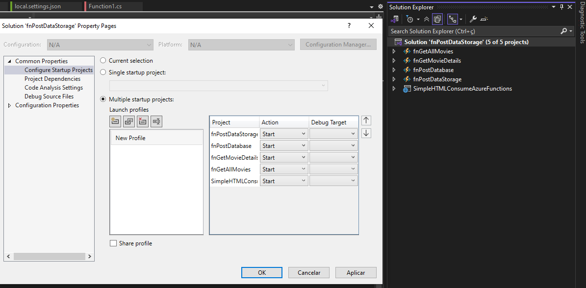
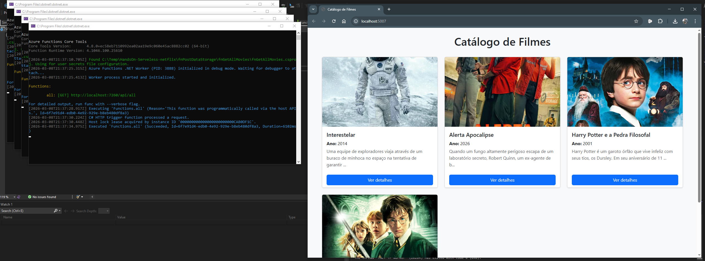

# 🎬 Azure Functions Movie Catalog


Projeto de estudo demonstrando uma **arquitetura serverless com Azure Functions** para gerenciamento de um catálogo de filmes pela plataforma DIO (https://www.dio.me/ - Curso Microsoft Certification Challenge #5 - AZ-204).

O sistema tem 4 Azure Functions que permitem:

- listar filmes
- consultar detalhes
- cadastrar novos filmes
- armazenar dados no Azure Storage

Um **frontend HTML simples** consome essas APIs para exibir os dados.

Este projeto foi desenvolvido com foco em aprendizado para a certificação:

> **AZ-204 — Developing Solutions for Microsoft Azure**

---

# 📂 Estrutura da Solution

```
fnPostDataStorage
│
├── fnGetAllMovies
│   └── Azure Function que retorna todos os filmes
│
├── fnGetMovieDetails
│   └── Azure Function que retorna detalhes de um filme
│
├── fnPostDatabase
│   └── Azure Function responsável por inserir novos filmes
│
├── fnPostDataStorage
│   └── Azure Function que grava dados no Azure Storage (imagem e video)
│
└── SimpleHTMLConsumeAzureFunctions
    └── Frontend HTML que consome as APIs (getall e getdetail)
```

---

# ⚙️ APIs disponíveis

## 📥 Listar filmes

```
GET /api/all
```

### Exemplo de retorno

```json
[
    {
        "id": "35d691df-8277-4cca-8e0d-f7f8862f4ec5",
        "title": "Interestelar",
        "year": "2014",
        "video": "https://staflixdiodev003.blob.core.windows.net/videos/Interestelar - Trailer Oficial 1 leg HD - YouTube.mp4",
        "thumb": "https://staflixdiodev003.blob.core.windows.net/images/6ricSDD83BClJsFdGB6x7cM0MFQ.webp",
        "duration": "2h49min",
        "director": "Christopher Nolan",
        "cast": "Matthew McConaughey, Anne Hathaway, Jessica Chastain",
        "description": "Uma equipe de exploradores viaja através de um buraco de minhoca no espaço na tentativa de garantir a sobrevivência da humanidade."
    },
    {
        "id": "f1665013-4586-4bc4-b5eb-12ed858bcf3d",
        "title": "Alerta Apocalipse",
        "year": "2026",
        "video": "https://staflixdiodev003.blob.core.windows.net/videos/Alerta Apocalipse Trailer Oficial HOJE nos Cinemas - YouTube.mp4",
        "thumb": "https://staflixdiodev003.blob.core.windows.net/images/3Ap6J9pYqgrxQaYWYdX2fyBYBWF.webp",
        "duration": "1h39min",
        "director": "Jonny Campbell",
        "cast": "Joe Keery, Georgina Campbell, Liam Neeson, Lesley Manville, Sosie Bacon, Vanessa Redgrave, Ellora Torchia, Aaron Heffernan, Andrew Brooke, Rob Collins",
        "description": "Quando um fungo altamente perigoso escapa de um laboratório secreto, Robert Quinn, um ex-agente de bioterrorismo que só queria curtir a aposentadoria em paz, é chamado de volta à ação. Ao lado de Travis e Naomi, dois jovens funcionários que definitivamente não ganham o suficiente para isso, ele precisa enfrentar uma ameaça invisível e fora de controle. Em uma corrida contra o tempo, o trio descobre que salvar o mundo dá muito mais trabalho do que parece."
    },
    {
        "id": "9bcf3157-36a2-4274-bfa5-975d38a59620",
        "title": "Harry Potter e a Pedra Filosofal",
        "year": "2001",
        "video": "https://staflixdiodev003.blob.core.windows.net/videos/Harry Potter e a Pedra Filosofal - Trailer - YouTube.mp4",
        "thumb": "https://staflixdiodev003.blob.core.windows.net/images/4rtsbE9aQ1qw4gv7yYwaNYfWFoS.webp",
        "duration": "2h32min",
        "director": "Chris Columbus",
        "cast": "Daniel Radcliffe, Rupert Grint, Emma Watson, Richard Harris, Maggie Smith, Alan Rickman, Robbie Coltrane, Tom Felton, Ian Hart, John Hurt",
        "description": "Harry Potter é um garoto órfão que vive infeliz com seus tios, os Dursley. Em seu aniversário de 11 anos ele recebe uma carta que mudará sua vida: um convite para ingressar em Hogwarts."
    },
    {
        "id": "844161a0-3265-4e67-a471-2a723e21f125",
        "title": "Harry Potter e a Câmara Secreta",
        "year": "2002",
        "video": "https://staflixdiodev003.blob.core.windows.net/videos/Harry Potter e a Camara Secreta - Trailer - YouTube.mp4",
        "thumb": "https://staflixdiodev003.blob.core.windows.net/images/811j0Jf2D0mK1U6RxXJoZgOB29n.webp",
        "duration": "2h41min",
        "director": "Chris Columbus",
        "cast": "Daniel Radcliffe, Rupert Grint, Emma Watson, Kenneth Branagh, Richard Harris, Maggie Smith, Alan Rickman, Robbie Coltrane, Tom Felton, Jason Isaacs, Bonnie Wright, Matthew Lewis",
        "description": "Carros voadores, árvores que lutam e um misterioso elfo, com um aviso ainda mais misterioso. Harry Potter está pronto para dar início ao segundo ano de sua maravilhosa jornada no mundo da bruxaria. Em Hogwarts nesse ano, aranhas falam, cartas dão broncas e a habilidade de Harry para falar com cobras voltará contra ele. De clubes de duelo a jogadores de quadribol desonestos, esse será um ano de aventura e perigo para todos. Quando a mensagem sangrenta na parede anuncia que a Câmara Secreta foi aberta, Harry, Rony e Hermione percebem que para salvar Hogwarts será preciso muita mágica e coragem."
    }
]
```

---

# 🎬 Detalhes de um filme

```
GET /api/detail?id={movieId}
```

### Exemplo

```
GET /api/detail?id=3dceea81-499c-4022-973c-0b03d3d45204
```

### Retorno

```json
{
    "id": "35d691df-8277-4cca-8e0d-f7f8862f4ec5",
    "title": "Interestelar",
    "year": "2014",
    "video": "https://staflixdiodev003.blob.core.windows.net/videos/Interestelar - Trailer Oficial 1 leg HD - YouTube.mp4",
    "thumb": "https://staflixdiodev003.blob.core.windows.net/images/6ricSDD83BClJsFdGB6x7cM0MFQ.webp",
    "duration": "2h49min",
    "director": "Christopher Nolan",
    "cast": "Matthew McConaughey, Anne Hathaway, Jessica Chastain",
    "description": "Uma equipe de exploradores viaja através de um buraco de minhoca no espaço na tentativa de garantir a sobrevivência da humanidade."
}
```

---

# ➕ Inserir novo filme

```
POST /api/movie
```

### Body

```json
{
  "title": "Harry Potter e a Câmara Secreta",
  "year": "2002",
  "video": "https://staflixdiodev003.blob.core.windows.net/videos/Harry Potter e a Camara Secreta - Trailer - YouTube.mp4",
  "thumb": "https://staflixdiodev003.blob.core.windows.net/images/811j0Jf2D0mK1U6RxXJoZgOB29n.webp",
  "duration": "2h41min",
  "director": "Chris Columbus",
  "cast": "Daniel Radcliffe, Rupert Grint, Emma Watson, Kenneth Branagh, Richard Harris, Maggie Smith, Alan Rickman, Robbie Coltrane, Tom Felton, Jason Isaacs, Bonnie Wright, Matthew Lewis",
  "description": "Carros voadores, árvores que lutam e um misterioso elfo, com um aviso ainda mais misterioso. Harry Potter está pronto para dar início ao segundo ano de sua maravilhosa jornada no mundo da bruxaria. Em Hogwarts nesse ano, aranhas falam, cartas dão broncas e a habilidade de Harry para falar com cobras voltará contra ele. De clubes de duelo a jogadores de quadribol desonestos, esse será um ano de aventura e perigo para todos. Quando a mensagem sangrenta na parede anuncia que a Câmara Secreta foi aberta, Harry, Rony e Hermione percebem que para salvar Hogwarts será preciso muita mágica e coragem."
}
```

---

# 🌐 Exemplo aplicação em execução

O projeto precisa ser configurado e criar os recursos necesários no Azure

- API Management service
- Azure Cosmos DB account
- Storage account

Configurar para iniciar os 5 projetos nesta solução



Exemplo aplicação rodando com alguns filmes já cadastrado




---

# 🧠 Conceitos de Azure demonstrados

Este projeto demonstra conceitos importantes cobrados na **AZ-204**:

✔ Azure Functions  
✔ Serverless Architecture  
✔ REST APIs  
✔ Azure Storage  
✔ Integração Frontend + API  
✔ JSON Serialization  
✔ HTTP Triggers  

---


# 📚 Tecnologias utilizadas

- **.NET / C#**
- **Azure Functions**
- **Azure Storage**
- **REST APIs**
- **Bootstrap**
- **HTML / JavaScript**

---

⭐ Se este projeto ajudou você, considere dar um **star no repositório**.
